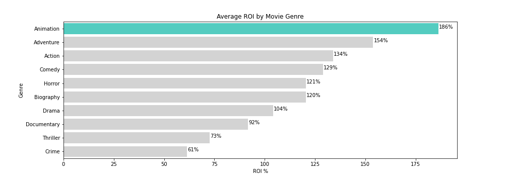
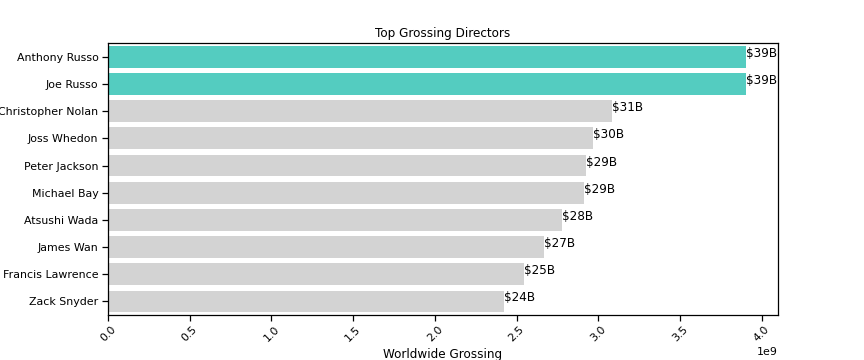
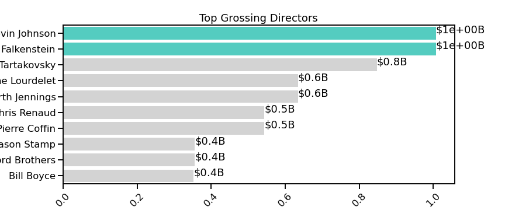

# Microsoft Movie Analysis


**Author**: Samantha Knee

## Overview

This project analyzes IMDB and other movie databases in order to provide recommendations to the new Microsoft studio. Descriptive analysis of the data shows that animation movies and movies released in June provide the strongest return on investment (ROI). Anthony and Joe Russo and Christopher Nolan direct the highest grossing films, while Kevin Johnson and Jun Falkenstein direct the highest grossing animation films. Microsoft's executives can use these recommendations to decide what genres of film to make, when to release the films, and who to hire as directors.

## Business Problem

Microsoft has decided to create a new movie studio, however, they do not have any business experience in running a successful movie business. Microsoft needs concrete recommendations on releasing films that will have the highest chance of high worldwide grossing or strong ROI, with ROI being especially important. ROI takes into account both the success of the movie at the box office and the initial investment into the movie, an important consideration for a new business line. 

The data questions answered in this analysis include:
- What movie genre generates the highest ROI?
- What release month generates the highest ROI?
- Which directors generate the highest grossings?

The financial investment into a movie varies greatly by genre, so analyzing genre is a simple way to narrow what Microsoft should focus on. Deciding on release month and which directors to hire are also simple decisions that can set the new studio up for success.

***

## Data

The data used for this analysis comes primarily from IMDb, the most comprehensive movie database available, which includes details such as film genre, release date, runtime, and the names and roles of all principals of the films. It includes data from all major movie studios whom Microsoft will be competing with. Each movie has a unique indentifier used throughout the data sets. The dependent variables targeted in this analysis include ROI and worldwide grossing, while the independent variables are genre, release date and director name. 

***

## Methods

This project uses descriptive analysis in order to determine the qualities of the most successful movies. It provides an overview of how Microsoft should produce its movies to produce the most financial success. In order to properly analyze the data, certain missing values and duplicates were removed from the initial data set. The datatypes of numerical columns were changed to numbers so they could be properly manipulated and used to create new columns, such as ROI. Data tables were also merged together and extreme outliers were removed.

***

## Results

Animation movies generate the highest ROI of all popular film genres, with adventure and action movies shortly behind. Animation movies also require less upfront investment than adventure and action movies. 




***

Movies released in the month of June have the highest ROI, and movies released in Q2 have the highest ROI on average compared to other quarters.


Directors who experience the strongest total worldwide grossing include Anthony and Joe Russo, directors of Avengers films and other superhero movies. Christopher Nolan's films also make him one of the highest grossing directors. When it comes to animation movies specifically, Kevin Johnson's and Jun Falkenstein's films have the highest total grossing.






## Conclusions

Based on this analysis, there are three recommendations for the Microsoft movie studio:
* **Focus on producing animation films.** Animation films have the highest ROI with the lowest upfront investment, so this could be a good starting genre for Microsoft before they start generating revenue.
* **Release movies in the month of June.** Movies released before the summer season begins are most likely to have a high ROI.
* **Hire the Russo brothers or Christopher Nolan as directors.** These directors have had the most career success overall based on total movie grossing.


***
## Next Steps

Further analyses could provide additional recommendations to Microsoft. These next steps could be completed using the current data set:
* **Which actors are in the highest grossing film.** This analysis could determine if a movie's grossing is more dependent on its directors or its actors.
* **How secondary genres affect ROI.** This analyis could explore which genre combination creates the most successful movies.
* **How movie length is related to ROI.** This analysis could investigate how runtime minutes can affect ROI, and if this varies by genre.


## For More Information

Please review the full analysis in this [Jupyter Notebook](./movie-data-analysis.ipynb) or this [presentation](./DS_Project_Presentation.pdf).

For any additional questions, please contact **Samantha Knee at samanthaknee24@gmail.com**

## Repository Structure


```
├── README.md                           <- The top-level README for reviewers of this project
├── movie-data-cleaning.ipynb           <- Narrative documentation of data cleaning in Jupyter notebook
├── movie-data-analysis.ipynb           <- Narrative documentation of analysis in Jupyter notebook
├── DS_Project_Presentation.pdf         <- PDF version of project presentation
├── data                                <- Both sourced externally and generated from code
└── images                              <- Both sourced externally and generated from code
```
